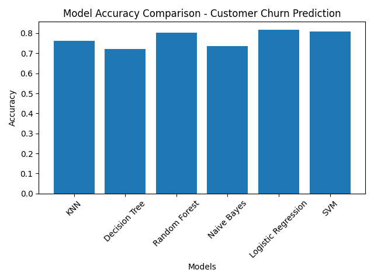
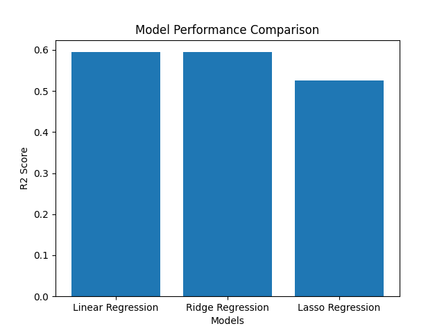
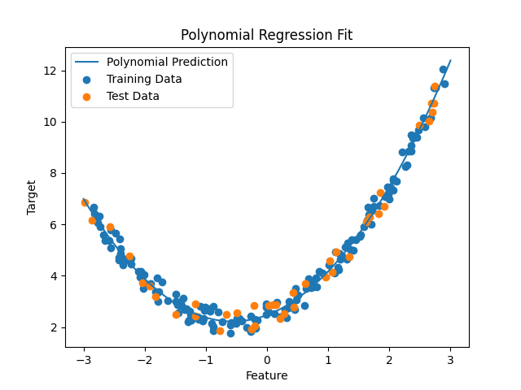

# Machine Learning Projects (Classification & Regression)

This repository contains machine learning projects implemented in Python using Scikit-Learn.  
The goal of these projects is to understand the complete machine learning workflow including data preprocessing, model training, evaluation, and comparison of different algorithms.

---

## 1. Breast Cancer Prediction

A classification model that predicts whether a tumor is **malignant (M)** or **benign (B)**.

### Techniques Used
- Data preprocessing
- Feature scaling using StandardScaler
- Random Forest Classifier
- Manual hyperparameter tuning

### Model Evaluation
- Accuracy Score
- Confusion Matrix
- Classification Report

### Libraries Used
- Pandas
- Scikit-learn
- NumPy

---

## 2. Customer Churn Prediction

A machine learning project to predict whether a telecom customer will **churn or stay**.

### Data Processing
- Handling missing values
- Converting categorical variables using One-Hot Encoding
- Feature scaling using StandardScaler

### Algorithms Compared
- K-Nearest Neighbors (KNN)
- Decision Tree
- Random Forest
- Naive Bayes
- Logistic Regression
- Support Vector Machine (SVM)

### Model Evaluation
Models are compared using **accuracy score**.

### Model Accuracy Comparison

Below is the accuracy comparison of different machine learning algorithms used for customer churn prediction.

---

## 3. Housing Price Prediction

A regression project that predicts **California housing prices** using multiple regression models.

### Algorithms Used
- Linear Regression
- Ridge Regression
- Lasso Regression

### Model Evaluation
- R² Score

### Model Performance Comparison

### Key Concepts
- Regularization
- Feature selection using Lasso
- Model comparison

---

## 4. Polynomial Regression

This project demonstrates how **polynomial regression** can model nonlinear relationships better than simple linear regression.

### Techniques Used
- Polynomial Feature Transformation
- Linear Regression
- Model visualization

### Polynomial Regression Visualization

---

## Technologies Used

- Python
- Pandas
- NumPy
- Scikit-learn
- Matplotlib
- Seaborn

---

## Author

Aditya Sharma  
B.Tech AI Student  
Meerut Institute of Engineering and Technology